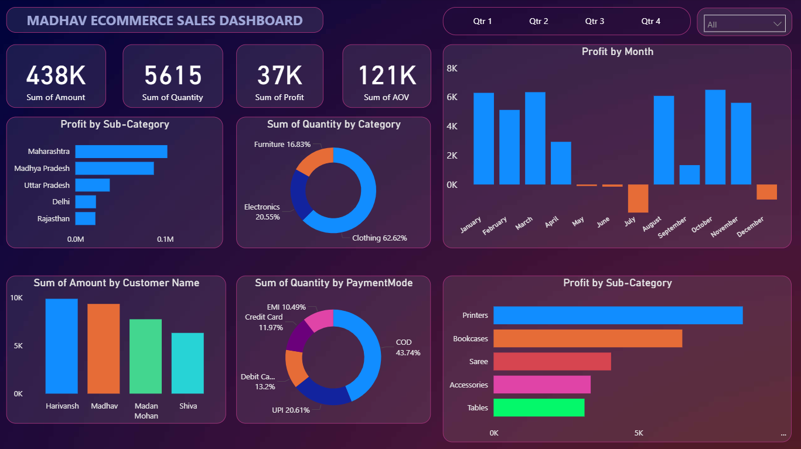

# Analyzing-E-commerce-Sales-Data_PowerB

##### **Objective:-**

    - The owner of Madhav E-Commerce Store has requested us to create a Power BI dashboard that tracks and analyzes their online sales across India, providing insights into sales performance, customer trends, and product demand.

## **Madhav E-Commerce Sales Dashboard**

- This Power BI dashboard tracks and analyzes Madhav E-Commerce’s online sales across India. It visualizes key metrics like total sales, orders, profit, and top products, along with interactive maps, trends, and category insights to support data-driven business decisions.

## OutPut:-

